# Threat Intel Aggregator


[](https://www.buymeacoffee.com/EthanAndrews)

A self-hosted threat intelligence platform that aggregates RSS feeds from 60+ security vendors, runs AI triage, correlates findings against your RunZero asset inventory, and surfaces actionable alerts through a dark-mode web dashboard.

Built to run standalone with zero cloud dependency, or fully integrated into an Azure/Entra/Sentinel environment — pick the tier that matches what you've got.

---

## Deployment tiers

| Tier | Script | AI triage | Auth | Storage | You get |
|------|--------|-----------|------|---------|---------|
| **Basic** | `scripts/setup-basic.sh` | Off | Local API key | Local Postgres (Docker) | Feed aggregation, IOC extraction, MITRE matrix, dashboards — no AI, no cloud, nothing to sign up for |
| **Basic + API** | `scripts/setup-basic-api.sh` | Anthropic (direct) | Local API key | Local Postgres (Docker) | Everything above, plus AI severity/TTP/summary triage |
| **Azure + API** | `scripts/setup-azure.ps1` | Azure AI Foundry | Microsoft Entra ID SSO | Your own Postgres (Azure DB for PostgreSQL, etc.) | Full deployment to Azure Container Apps, SSO with per-user roles. (The detections.ai pipeline integration is coming in a future release — see below.) |

All three run the exact same application code — the only thing that changes is which env vars are set. See [Environment Variables](#environment-variables) for the full reference.

```bash
# Basic — no AI, no cloud
./scripts/setup-basic.sh

# Basic + API — adds direct Anthropic triage
./scripts/setup-basic-api.sh

# Azure + API — full SIEM-integrated deployment (PowerShell 7+, az CLI)
./scripts/setup-azure.ps1
```

The two bash scripts stand up a local Postgres container, apply the schema, and generate `backend/.env` / `frontend/.env.local` for you — then print the two commands to actually start the app (`pip install` + run backend, `npm install` + run frontend dev server). `setup-azure.ps1` is a thin wrapper around `infra/provision.ps1`, the real Azure Container Apps deployment runbook.

---

## Features

- **Feed aggregation** — polls 60+ Tier 1/2/3 security RSS feeds on a schedule; deduplicates and filters promotional content automatically
- **AI triage** — classifies each entry with severity (Critical/High/Medium/Low/Informational), MITRE ATT&CK TTPs, and a plain-English summary. Provider-modular: direct Anthropic API or Azure AI Foundry, switchable via one env var with no functionality lost either way
- **IOC extraction** — automatically extracts IPs, domains, URLs, file hashes, and CVEs from each entry
- **RunZero integration** — syncs your asset inventory and correlates threat intel against live assets; matches on CVEs, software names, OS versions, and IP addresses. Three sub-tabs under `RUNZERO`: **Matches** (entries correlated against your inventory, filterable by severity/date/confidence/KEV), **Exposure** (org-level confirmed/possible standing with remediation tracking), and **Metrics** (intake vs. remediation trends over time)
- **Your Stack** — define the software/OS in your environment; re-scores all entries by relevance
- **IOC ledger** — searchable ledger of all extracted indicators with entry cross-references and STIX/CSV export
- **MITRE ATT&CK matrix** — heatmap of TTP coverage across your ingested threat intel
- **Feed health dashboard** — per-feed poll status, consecutive failure tracking, and 7-day article volume
- **Detections** — a 9-tab review surface (see below) covering everything registered as a detection, whether AI-generated, imported from your own files, or synced from a live Sentinel workspace
- **Modular auth** — Microsoft Entra ID SSO with role-based access, or a single shared local API key with zero Azure dependency. Auto-detected by the frontend; see [Auth modes](#auth-modes)

### Two detections-related features

This repo actually ships two related but independently-usable things under the "detections" umbrella:

1. **The `DETECTIONS` tab** — a self-contained review surface, split into nine sub-tabs:
   - **All Detections** — the full catalog of registered analytics, filterable by technique/disposition/review state, each expandable to its description and full KQL.
   - **Defender Custom Detections** — the same catalog, locked to detections destined for Microsoft Defender for Endpoint's custom detection rules rather than Sentinel analytics rules.
   - **Alignment Reviews** — whenever a detection analytic is registered against a MITRE technique, an AI check compares its actual coverage against MITRE's own description of that technique. When it diverges or only partially covers the technique, it lands here as a human review item with the AI's reasoning, a suggested KQL fix, and that fix's own validation result (static gate + backtest) — never a blind suggestion.
   - **Disposition Alerts** — a rot-detection queue: an approved analytic whose telemetry decays or whose underlying rule starts erroring gets flagged here for re-review, named by its own detection rather than only the shared MITRE technique.
   - **Generated Hunts** — detections are grouped into hunts (one per imported file today; one per originating TI article/detections.ai project once that integration ships), matching Microsoft Sentinel's own Hunts feature. A hunt can be synced into a real Sentinel workspace as a `Microsoft.SecurityInsights/hunts` object plus its constituent saved-search queries (gated by `SENTINEL_HUNTING_SYNC_ENABLED` and a `mode` — off/manual/auto — configurable per-team in Settings > API Settings; never a silent auto-push unless you opt in).
   - **Sentinel Hunts** — the live inventory of what's actually deployed to your Sentinel workspace's Hunting feature, pulled directly from ARM rather than this app's own sync history; includes per-query test/tune suggestions you can apply or dismiss in place.
   - **Sentinel Analytics Rules** — the same idea for Microsoft Sentinel's Analytics Rules (`Microsoft.SecurityInsights/alertRules`) — a distinct Sentinel resource type from Hunting, since these are what actually fire incidents/alerts on a schedule — with the same tune-suggestion apply/dismiss workflow.
   - **Local Detections** — see [Running without Sentinel or an AI provider](#running-without-sentinel-or-an-ai-provider-local-detections-import) below.
   - **Audit Log** (admin-only) — a cross-pipeline record of every check this app has actually run: AI-generated detection gate/control-probe results, Sentinel hunt sync attempts, and Sentinel hunt-query/analytics-rule test runs, combined into one paginated, filterable list — deliberately covering what no single review tab does on its own.

   Runs entirely inside the main backend, no extra deployment needed for the review surface itself. Its own API design deliberately follows detections.ai's conventions below, even though it's fully self-contained.
2. **detections.ai pipeline orchestrator — coming soon.** detections.ai has a public API in development for AI-assisted detection generation, and this repo has a real integration built for it (`backend/detection_pipeline/orchestrator.py`) that takes triaged threat intel, checks it against existing detection coverage, and generates draft KQL for your Sentinel workspace as a scheduled job. This integration will support that API once it's available, and isn't part of this public release yet. In the meantime, **you don't need it to use the Detections tab at all** — [Local Detections Import](#running-without-sentinel-or-an-ai-provider-local-detections-import) below covers the same "get real detections into this app" goal for AI-generation-free and Sentinel-free setups today.

### Running without Sentinel or an AI provider: Local Detections Import

Given the app's name and primary pitch, the single most common question from a self-hoster on the **Basic** tier is probably going to be *"I don't have Sentinel or an AI provider configured — can I still get anything out of the Detections/Hunts tabs?"* The answer is yes: point the app at a folder of your own detection rule files (hand-written, exported from a real Sentinel/Defender tenant, or pulled from a public Sigma/Sentinel rule repo) and it will catalog, MITRE-tag, and statically validate them — no Sentinel connection and no `DETECTIONS_AI_API_KEY`/Anthropic key required for any of it.

- **Formats supported, day one:** raw `.kql`/`.txt`/`.yar`/`.spl`-or-any-extension files, each optionally paired with a `.json`/`.yaml` sidecar (`{"file": "myrule.kql", "title": "...", "description": "...", "technique_id": "T1059.001"}`) for metadata Microsoft's own export doesn't need declared separately; YARA; Suricata; Sigma YAML (single- or multi-document); Splunk SPL; and Microsoft's own native exported Analytics Rule/Hunting Query JSON (only `Scheduled`-kind rules carry a raw KQL query this app can evaluate — every other kind is recognized and reported, not silently skipped).
- **What actually runs on an imported file:** static validation (the same durability/findings engine the AI-generation path uses) for KQL content; a MITRE alignment check too, if you *do* have an AI provider configured (an independent axis from Sentinel — you can have one, both, or neither); everything Sentinel-dependent (backtesting, telemetry probes, disposition tracking) stays out of scope and renders as "no Sentinel connection configured" rather than a misleading blank cell.
- **Where it shows up:** imported content becomes a normal hunt/detection row — same tables, same review workflow, same MITRE technique display as anything the AI pipeline generates — so it appears in the regular `ALL DETECTIONS`/`GENERATED HUNTS` views too, not just its own tab. The dedicated **Local Detections** sub-tab (under `DETECTIONS`, admin-only to trigger an import) is where you point it at a folder and watch per-file progress/results.
- **Setup:** set `LOCAL_IMPORT_DIR` to an absolute path on the backend's filesystem (a mounted volume, in a container deployment) — everything imported must live under that root; the UI lets you pick a sub-path underneath it, never an arbitrary filesystem location. See [Environment Variables](#environment-variables).
- **Try it immediately:** `examples/local-detections-samples/` ships a small ready-to-import folder — two valid KQL rules (one paired with a `.json` sidecar to show that mechanism), one deliberately invalid rule (to see the flagged-invalid banner), and one unrecognized file (to see the failed-import banner). Point `LOCAL_IMPORT_DIR` at it to see all three result states on your very first import, no rule-writing required.

**Local Detections** — a completed import run: the summary banner calls out files that were cataloged but flagged invalid by static analysis (here, a rule that alerts on a single hardcoded hash) right alongside the ones that imported cleanly, and every file becomes a normal hunt/detection row below

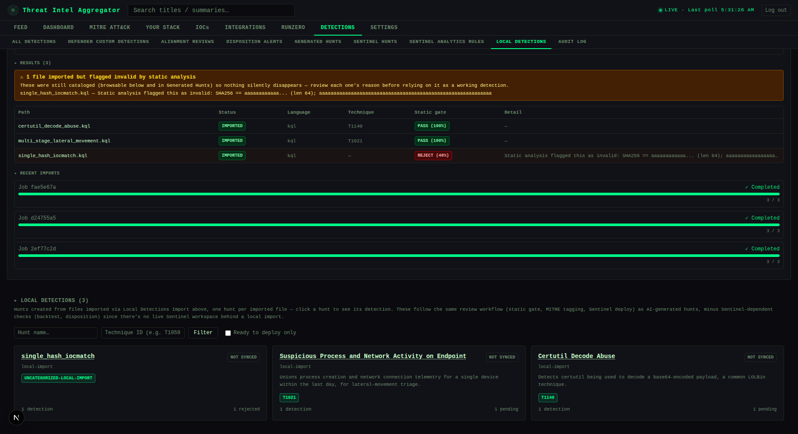

---

## Screenshots

All screenshots below use synthetic data (fake org names, RFC 5737 example IPs, `.example` domains) generated for documentation — no real threat intel or customer data.

**Feed** — browse and filter triaged threat intel entries with severity, tags, IOCs, and TTPs

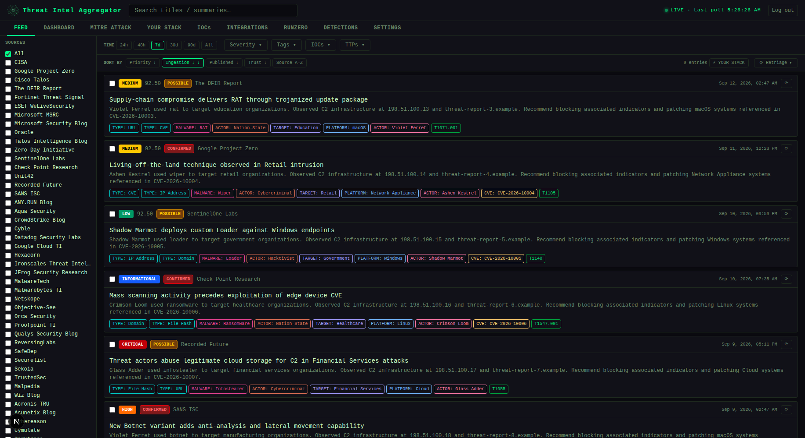

<br>

**Dashboard** — at-a-glance severity breakdown and top MITRE ATT&CK techniques

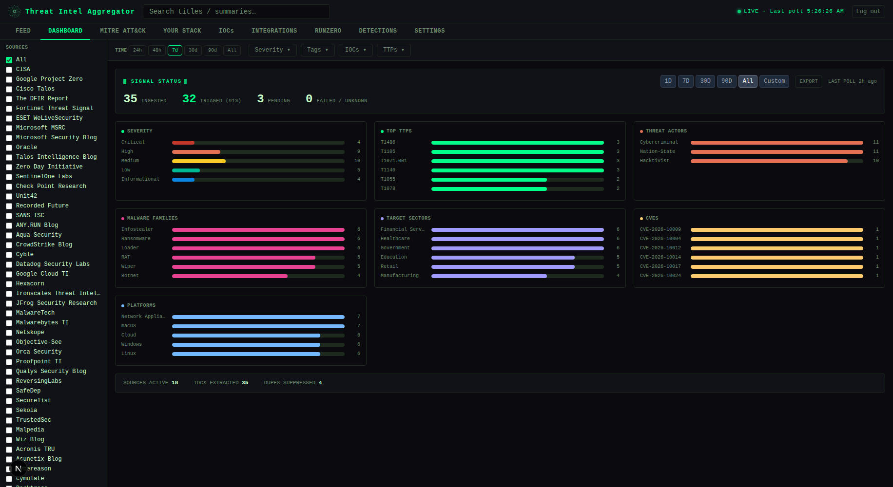

<br>

**MITRE ATT&CK** — full matrix heatmap of technique coverage across ingested intel

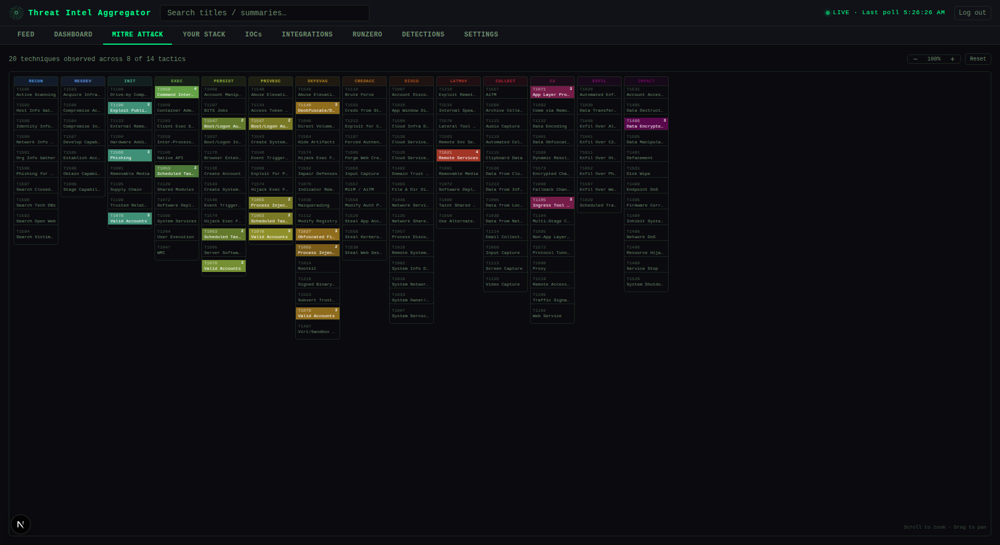

<br>

**Your Stack** — define your environment; feed entries are re-scored by relevance

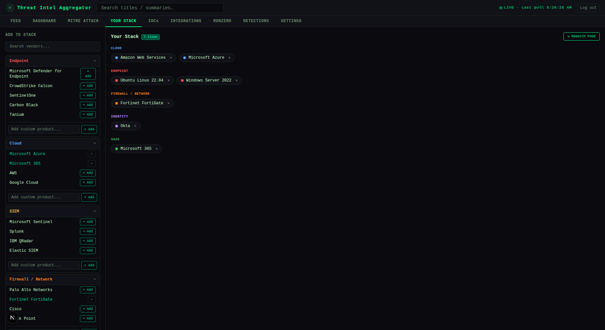

<br>

**IOCs** — searchable ledger of all extracted indicators with STIX/CSV export

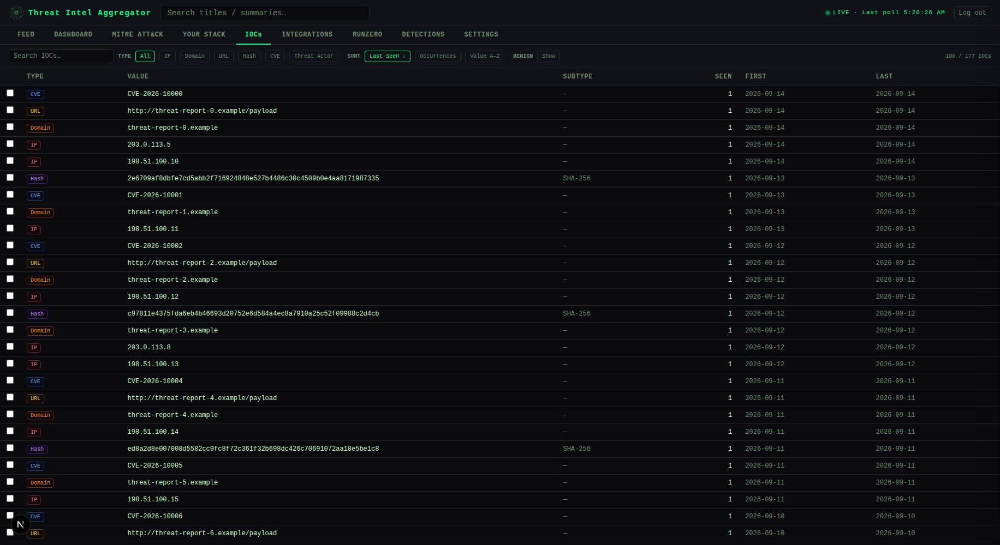

<br>

**Integrations** — connector overview for Sentinel, Defender, and RunZero: configured/enabled status and shortcuts into each one's own tab

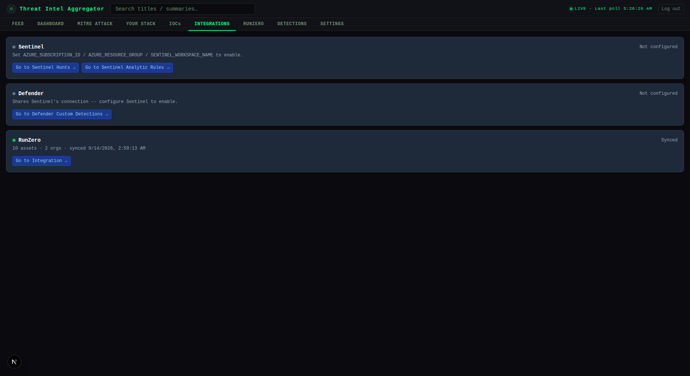

<br>

**RunZero** — asset correlation, org-level exposure tracking, and remediation metrics, all sourced from your RunZero inventory

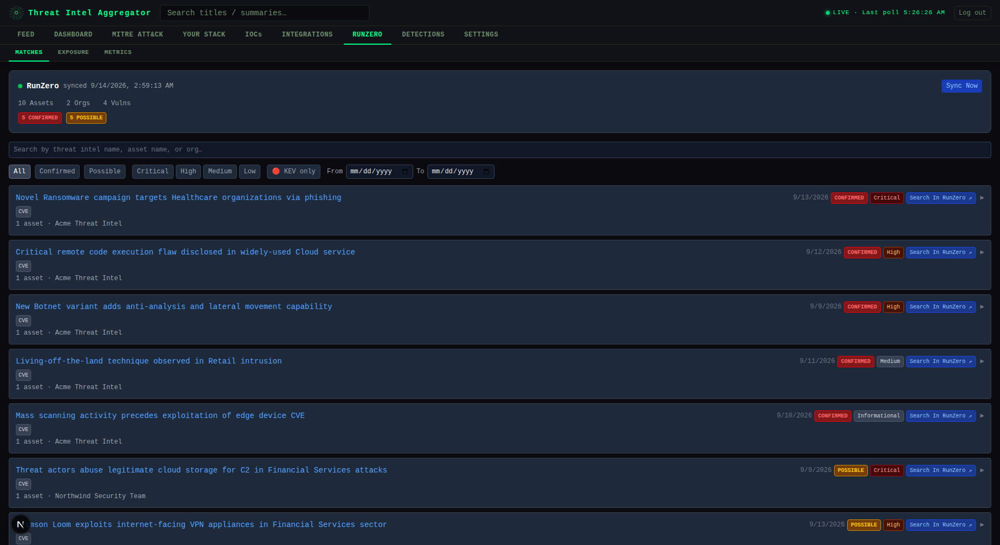

<br>

**Exposure** — orgs ranked by threat match count; click any card to see matched entries

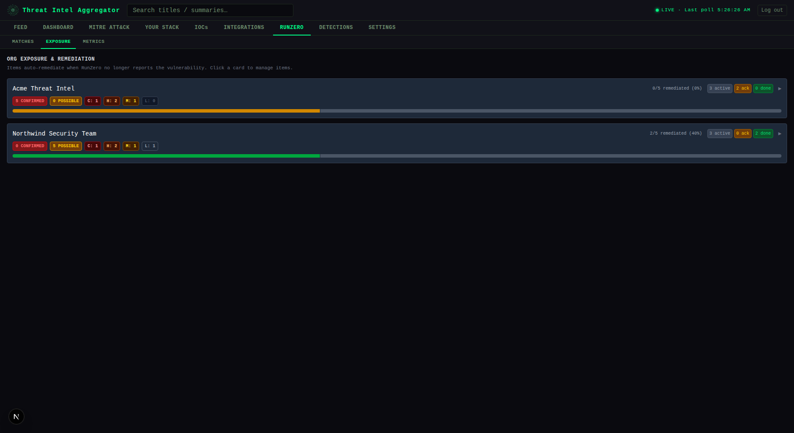

<br>

**Detections** — the full catalog of registered analytics (AI-generated and locally-imported alike), each with its static-gate/backtest/review status and MITRE technique

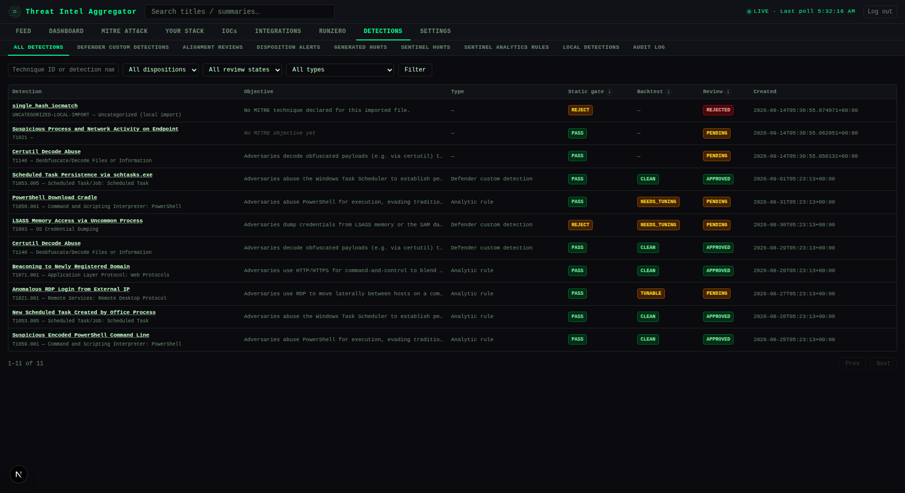

<br>

**Settings** — AI triage controls, feed health monitoring, source trust scores, and user management

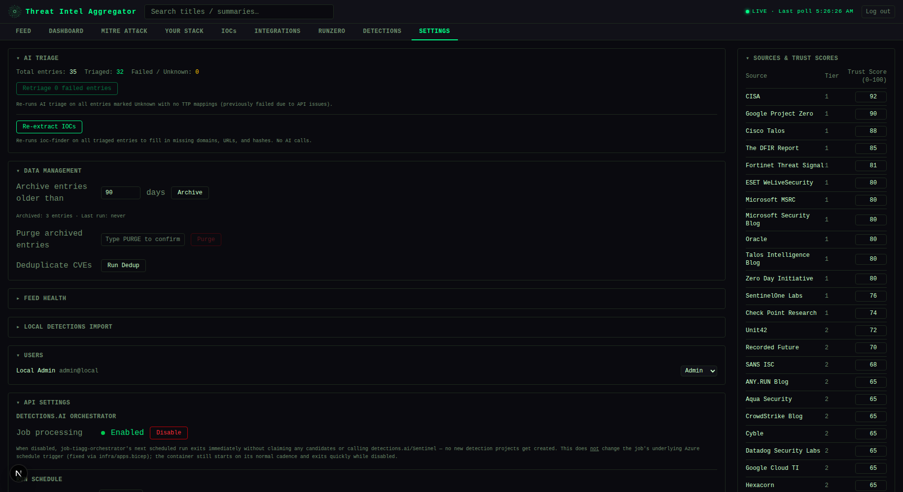

---

## Architecture

```
┌─────────────────────────────────────────┐
│  Next.js 16 frontend (port 3000)        │
│  Tailwind CSS · dark theme              │
└──────────────┬──────────────────────────┘
               │ REST API (Bearer token)
┌──────────────▼──────────────────────────┐
│  FastAPI backend (port 8000)            │
│  APScheduler · slowapi rate limiting    │
└──┬──────────┬──────────┬────────────┬───┘
   │          │          │            │
Postgres   AI provider  RunZero API  detections.ai
           (modular:    (asset sync)  (coming soon --
           Anthropic or                see Features below)
           Azure AI Foundry)
```

**Backend** (`backend/`) — Python 3.12 + FastAPI. Postgres for all storage (SQLite and Azure Blob Storage have been fully retired). AI provider and auth method are both env-var-selected, not hardcoded — see below.

**Frontend** (`frontend/`) — Next.js 16, plain JavaScript, Tailwind CSS. Auto-detects auth mode from the backend at load time.

**Infra** (`infra/`) — Azure Bicep templates for Container Apps, Key Vault, and Container Registry (`apps.bicep` + `platform.bicep` + `app-stack.bicep`, deployed via `provision.ps1`). Only relevant to the Azure + API tier.

---

## Auth modes

`AZURE_AD_TENANT_ID` set → **Entra mode**: Microsoft Entra ID SSO, per-user roles (first login becomes admin, everyone else defaults to viewer).

`AZURE_AD_TENANT_ID` unset → **Local mode**: a single shared `LOCAL_API_KEY` grants admin access to anyone who has it. No user management, no Azure dependency. The frontend calls `GET /api/auth/mode` on load and renders the matching login screen automatically — nothing to configure on the frontend side.

Both modes issue the same kind of app-signed JWT afterward, so every other route (`require_auth`/`require_admin`) works identically regardless of which mode issued the token.

---

## Local Development

### Prerequisites

- Python 3.12+
- Node.js 20+
- Docker (for local Postgres — see the setup scripts)

### Fastest path

Run `scripts/setup-basic.sh` or `scripts/setup-basic-api.sh` (see [Deployment tiers](#deployment-tiers)) — they handle Postgres and `.env` generation for you. Then:

```bash
cd backend  && pip install -r requirements.txt && uvicorn main:app --reload --port 8000
cd frontend && npm install && npm run dev
```

### Manual setup

```bash
cd backend
python -m venv .venv
source .venv/bin/activate        # Windows: .venv\Scripts\activate
pip install -r requirements.txt
cp env.example .env              # fill in required values — see Environment Variables below
uvicorn main:app --reload --port 8000
```

```bash
cd frontend
npm install
cp env.local.example .env.local  # set NEXT_PUBLIC_API_URL=http://localhost:8000
npm run dev
```

### Docker Compose (both services)

```bash
cp backend/env.example backend/.env   # fill in required values
docker compose up --build
```

Frontend → http://localhost:3000
Backend API docs → http://localhost:8000/docs

---

## Environment Variables

Copy `backend/env.example` to `backend/.env` and fill in. Grouped by what tier needs them:

**Always required:**

| Variable | Description |
|----------|-------------|
| `PG_DSN` | Postgres connection string |
| `JWT_SECRET_KEY` | Secret for signing app session tokens (`python -c "import secrets; print(secrets.token_hex(32))"`) |

**Auth — pick one mode:**

| Variable | Description |
|----------|-------------|
| `LOCAL_API_KEY` | Local mode: shared key that grants admin access. Leave `AZURE_AD_TENANT_ID` unset to activate this mode |
| `AZURE_AD_TENANT_ID` | Entra mode: tenant ID for SSO. Setting this activates Entra mode |
| `AZURE_AD_CLIENT_ID` | Entra mode: app registration client ID |
| `AZURE_AD_CLIENT_SECRET` | Entra mode: app registration secret (frontend only) |
| `NEXTAUTH_SECRET` | Entra mode: NextAuth session encryption secret (frontend only) |

**AI triage — optional, pick one provider (omit both to run with triage disabled):**

| Variable | Description |
|----------|-------------|
| `AI_PROVIDER` | `anthropic` (default) or `azure` |
| `ANTHROPIC_API_KEY` | Direct Anthropic API key |
| `AZURE_FOUNDRY_ENDPOINT` | Azure AI Foundry endpoint, e.g. `https://<resource>.services.ai.azure.com/anthropic` |
| `AZURE_FOUNDRY_API_KEY` | Azure AI Foundry API key |
| `AZURE_FOUNDRY_DEPLOYMENT` | Foundry deployment name (default `claude-haiku-4-5`) |
| `AZURE_FOUNDRY_API_VERSION` | Foundry API version (default `2025-05-01`) |

**Optional:**

| Variable | Description |
|----------|-------------|
| `RUNZERO_API_TOKEN` | Enables RunZero asset sync and correlation |
| `ALLOWED_ORIGINS` | Comma-separated CORS allowlist (default `http://localhost:3000`) |
| `ENABLE_SCHEDULER` | Set `false` to disable the background feed poller (default `true`) |
| `ARCHIVE_AFTER_DAYS` | Auto-archive threshold in days (default `90`) |
| `PG_POOL_MIN` / `PG_POOL_MAX` / `PG_POOL_TIMEOUT` | Postgres connection pool tuning (defaults `1` / `10` / `30`) |
| `LOCAL_IMPORT_DIR` | Enables [Local Detections Import](#running-without-sentinel-or-an-ai-provider-local-detections-import) — absolute path on the backend's filesystem that every import is confined to. Unset disables the feature entirely (its tab shows a "not configured" message) |

**Frontend** (`frontend/.env.local` or `frontend/env.local.example`):

| Variable | Description |
|----------|-------------|
| `NEXT_PUBLIC_API_URL` | Backend URL as seen by the browser. Baked into the JS bundle at build time. Leave **unset** to route API calls through the built-in same-origin proxy (`frontend/pages/api/[...proxy].js`) instead — required whenever the backend has no public ingress (e.g. the Azure + API tier's internal-only Container App) |
| `BACKEND_URL` | Backend URL as seen by the Next.js server itself. Used by NextAuth's login exchange and, when `NEXT_PUBLIC_API_URL` is unset, by the same-origin proxy that forwards every `/api/*` browser request server-side |

**detections.ai orchestrator — coming soon** (not part of this public release yet; documented here for when it ships. Azure + API tier, separate deployable — see `backend/detection_pipeline/orchestrator.py`):

| Variable | Description |
|----------|-------------|
| `DETECTIONS_AI_API_KEY` | Required to run the orchestrator at all |
| `SENTINEL_WORKSPACE_ID` | Log Analytics workspace customer ID (GUID), for backtesting. Optional |
| `PIPELINE_BATCH_SIZE` | Entries per run (default `5`) |
| `PIPELINE_DRY_RUN` | `true` to claim and log without calling the API |
| `PIPELINE_LANGUAGE` | Detection query language (default `kql`) |

**Sentinel Hunts sync** (optional, off by default — see Settings > API Settings for the on/off/manual/auto mode):

| Variable | Description |
|----------|-------------|
| `SENTINEL_HUNTING_SYNC_ENABLED` | `true` to allow any hunt sync attempt at all. Unset/false is a pure no-op — zero ARM calls |
| `AZURE_SUBSCRIPTION_ID` | Subscription containing the Sentinel workspace |
| `AZURE_RESOURCE_GROUP` | Resource group containing the Sentinel workspace |
| `SENTINEL_WORKSPACE_NAME` | The workspace's **name**, not its customer ID — a different value than `SENTINEL_WORKSPACE_ID` above, which the backtesting data-plane client uses instead |

---

## Azure Deployment

The real, current IaC is `infra/apps.bicep` + `infra/platform.bicep` + `infra/app-stack.bicep`, deployed via `infra/provision.ps1` (or the thin wrapper `scripts/setup-azure.ps1`). It provisions Container Apps, Key Vault-backed secrets, and managed identities — Postgres itself is not provisioned by this repo; point `PG_DSN` (stored as the `pg-dsn` Key Vault secret) at any reachable Postgres server.

```powershell
./scripts/setup-azure.ps1
# or directly:
cd infra
cp migration.psd1.example migration.psd1   # fill in your resource group, apps, etc.
./provision.ps1
```

`provision.ps1` is idempotent — safe to re-run after editing the manifest. See its own header comment for the full step-by-step (platform → app stack → secrets → Easy Auth → image import → apps → post-checks).

The detections.ai orchestrator (a scheduled Container Apps Job driven by an `Orchestrator` block in `migration.psd1` — see `migration.psd1.example` for the shape, and store your key as the `DETECTIONSAIAPIKEY` Key Vault secret) isn't part of this public release yet — see [Two detections-related features](#two-detections-related-features) above.

---

## Project Structure

```
├── backend/
│   ├── main.py                  # FastAPI app, all endpoints
│   ├── db.py                    # Postgres queries
│   ├── pgcompat.py              # connection pool + SQLite-style placeholder translation
│   ├── feed_manager.py          # RSS polling, AI triage (provider-modular), scheduler
│   ├── enrichment.py            # IOC extraction, KEV cache, stack rematch
│   ├── runzero_sync.py          # RunZero asset sync and correlation engine
│   ├── dedup.py                 # CVE deduplication logic
│   ├── auth.py                  # Entra ID SSO + local API-key auth, app JWT sign/verify
│   ├── ioc_export.py            # STIX 2.1 and CSV export
│   ├── stack_presets.py         # Pre-built tech stack templates
│   ├── detection_pipeline/      # detections.ai orchestrator, MITRE alignment-check,
│   │                            # Sentinel hunts/analytics-rules sync + tuning,
│   │                            # audit log, local_import.py (Local Detections Import)
│   └── tests/                   # pytest test suite, incl. fixtures/local_import/
├── frontend/
│   ├── pages/
│   │   ├── index.js              # Main app shell + tab routing
│   │   └── login.js              # Entra ID or local API-key login, auto-detected
│   ├── lib/
│   │   ├── authMode.js           # GET /api/auth/mode, cached per page load
│   │   ├── authFetch.js          # Bearer auth + 401-retry wrapper
│   │   └── authSession.js        # token storage, JWT decode/expiry helpers
│   └── components/
│       ├── layout/                # TopBar, Sidebar, TabBar, TopFilterBar, TimeRangeToggle
│       ├── feed/                  # FeedList, FeedCard
│       ├── integrations/          # IntegrationsPanel, ExposurePanel, RunZeroPanel,
│       │                          # RunZeroMatchesPanel, RunZeroMetricsPanel
│       ├── detections/            # DetectionsPanel (tab shell) + one component per
│       │                          # sub-tab: DetectionsCatalogPanel, AlignmentReviewPanel,
│       │                          # DispositionAlertsPanel, HuntsPanel, SentinelHuntsPanel,
│       │                          # SentinelAnalyticsRulesPanel, LocalDetectionsPanel,
│       │                          # AuditPanel, plus shared TuningSuggestionBadge
│       ├── settings/              # SettingsPanel, CadencePicker, SeverityCards
│       └── mitre/                 # MitreMatrix
├── infra/                       # Azure Bicep templates + provision.ps1
├── scripts/                     # Tiered setup scripts (see Deployment tiers)
└── docker-compose.yml
```

---

## Feed Sources

63 feeds across three tiers:

- **Tier 1** — CISA, Cisco Talos, Fortinet Threat Signal, ESET WeLiveSecurity, Microsoft Security Blog, SentinelOne Labs, Google Project Zero, Zero Day Initiative, Check Point Research, Talos Intelligence Blog, The DFIR Report, Oracle
- **Tier 2** — Recorded Future, Malpedia, SANS ISC, Securelist, Unit42, Proofpoint TI, Malwarebytes TI, Wiz Blog, Datadog Security Labs, ReversingLabs, Sekoia, Cyble, ANY.RUN Blog, and more
- **Tier 3** — BleepingComputer, Krebs on Security, Schneier on Security, The Hacker News, Dark Reading, CrowdStrike Blog, Snyk, Semgrep, and more

---

## Security

- All API endpoints require `Authorization: Bearer <token>`
- Timing-safe token comparison (`secrets.compare_digest`) for the local auth key
- Parameterized SQL throughout — no string interpolation in queries
- CORS restricted to explicit origin allowlist
- LLM inputs sanitized before AI provider calls; outputs validated before storage
- Containers run as non-root with all Linux capabilities dropped
- No secrets baked into images — loaded at runtime from `.env` / Azure Key Vault

---

## License

MIT — see [LICENSE](LICENSE).
